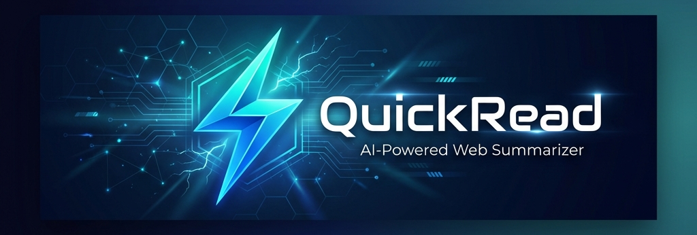

# QuickRead - AI-Powered Web Content Summarizer

<p align="center">
  
</p>

<p align="center">
  
  
  
  
</p>

---

## ✨ Features

- **🚀 One-Click Summarization** - Summarize any webpage with a single click
- **📊 3 Summary Formats** - Choose from Brief, Bullets, or Detailed summaries
- **💾 Auto-Save History** - Summaries are automatically saved for later reference
- **📋 Copy to Clipboard** - Easily copy summaries with one click
- **🔐 Secure API Storage** - Your API key is stored locally and never shared
- **🎨 Modern UI** - Beautiful bluish tech gradient design with glassmorphism effects

---

## 📸 Screenshots

<details>
<summary>Click to view screenshots</summary>

### Main Popup
<div style="padding-bottom: 10;">
    <p>The main interface shows format selection, summarize button, and results.</p>
</div>
<a href="https://imgbb.com/"></a>

### Settings Page
<div style="padding-bottom: 10;">
    <p>Configure your Gemini API key with validation and troubleshooting.</p>
</div>
<a href="https://imgbb.com/"></a>

### Summary History
<div style="padding-bottom: 10;">
    <p>View and manage your saved summaries.</p>
</div>
<a href="https://ibb.co/QFLpwSsS"></a>

</details>

---

## 🚀 Installation

### From Source (Developer Mode)

1. **Clone the repository**
   ```bash
   git clone https://github.com/AbizarDholkawala/QuickRead.git
   ```

2. **Open Chrome Extensions**
   - Navigate to `chrome://extensions/`
   - Enable **Developer mode** (toggle in top-right corner)

3. **Load the extension**
   - Click **Load unpacked**
   - Select the cloned `QuickRead` folder

4. **Pin the extension**
   - Click the puzzle icon in Chrome toolbar
   - Pin QuickRead for easy access

---

## ⚙️ Setup

### Getting Your API Key

1. Visit [Google AI Studio](https://aistudio.google.com/apikey)
2. Sign in with your Google account
3. Click **Create API Key**
4. Copy the generated key

### Configuring QuickRead

1. Click the QuickRead extension icon
2. Click the **⚙️ gear icon** to open settings
3. Paste your API key
4. Click **Test API Key** to verify
5. Click **Save API Key**

---

## 📖 Usage

1. **Navigate** to any webpage you want to summarize
2. **Click** the QuickRead extension icon
3. **Select** your preferred format:
   - **Brief** - 2-3 sentence summary
   - **Bullets** - 5-8 key points
   - **Detailed** - 3-4 comprehensive paragraphs
4. **Click** "Summarize This Page"
5. **Copy** or let it auto-save to history

---

## 🛠️ Tech Stack

- **Frontend**: HTML5, CSS3, JavaScript (ES6+)
- **API**: Google Gemini AI (gemini-2.5-flash)
- **Storage**: Chrome Storage API
- **Manifest**: Chrome Extension Manifest V3

---

## 📁 Project Structure

```
QuickRead/
├── manifest.json        # Extension configuration
├── popup.html           # Main popup interface
├── popup.css            # Popup styles
├── popup.js             # Popup logic & history management
├── settings.html        # Settings page
├── settings.css         # Settings styles
├── settings.js          # Settings logic & API key management
├── background.js        # Service worker & Gemini API calls
└── icons/
    ├── icon16.png       # 16x16 icon
    ├── icon48.png       # 48x48 icon
    └── icon128.png      # 128x128 icon
```

---

## 🔒 Privacy

- Your API key is stored **locally** in Chrome's storage
- API key is **only sent** to Google's Gemini API for summarization
- **No data** is collected or sent to third parties
- Page content is processed **on-demand** and not stored externally

---

## 🐛 Troubleshooting

### API Key Issues

| Error | Solution |
|-------|----------|
| Invalid API Key | Verify the key was copied correctly from Google AI Studio |
| Quota Exceeded | Wait a few minutes or check your usage limits |
| Network Error | Check your internet connection |
| Permission Denied | Enable the Generative Language API in Google Cloud |

### Extension Issues

- **Not working on certain pages**: Some pages (chrome://, file://) are restricted
- **Summary not appearing**: Ensure the page has enough text content
- **Extension not loading**: Check for errors in `chrome://extensions/`

---

## 🤝 Contributing

Contributions are welcome! Please feel free to submit a Pull Request.

1. Fork the repository
2. Create your feature branch (`git checkout -b feature/AmazingFeature`)
3. Commit your changes (`git commit -m 'Add some AmazingFeature'`)
4. Push to the branch (`git push origin feature/AmazingFeature`)
5. Open a Pull Request

---

## 📄 License

This project is licensed under the MIT License - see the [LICENSE](LICENSE) file for details.

---

## 🙏 Acknowledgments

- [Google Gemini AI](https://ai.google.dev/) for the powerful summarization API
- [Lucide Icons](https://lucide.dev/) for the beautiful SVG icons
- Chrome Extension documentation for the excellent guides

---

<p align="center">
  Made with ❤️ by <a href="https://github.com/AbizarDholkawala">Abizar Dholkawala </a>
</p>


